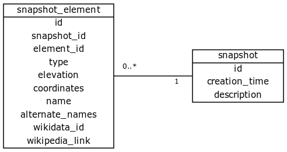
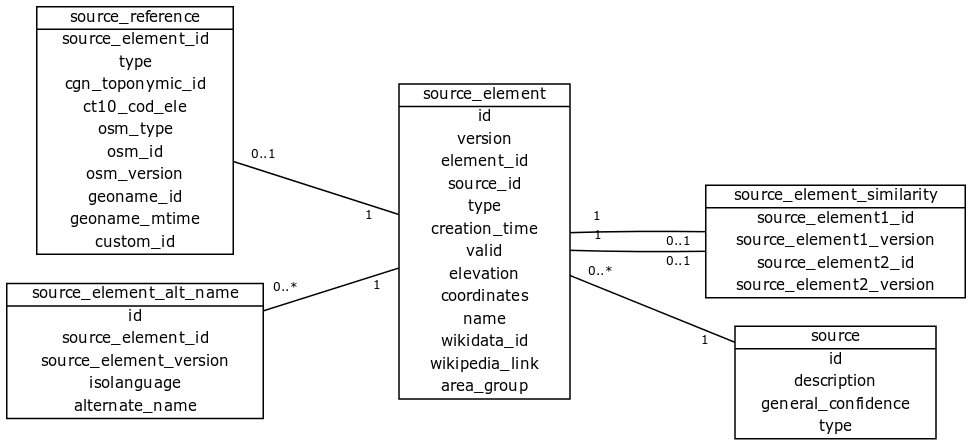
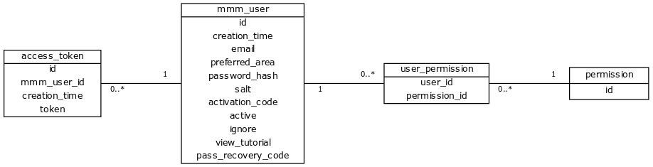
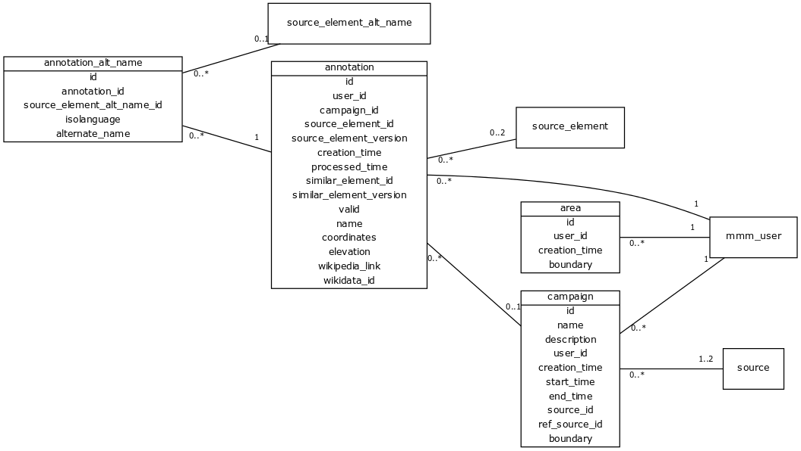

# Map My Mountains Data Model
This directory contains the definition and the documentation of the data model.

## Logical Data Model

**snapshot**: a copy of the state of the sources at a particular point in time.
- `id`: snapshot ID.
- `creation_time`: timestamp of when the snapshot was created.
- `description`: snapshot description.

**snapshot_element**: a geographic element belonging to a snapshot.
- `id`: snapshot element ID.
- `snapshot_id`: the snapshot to which the element belong,
- `element_id`: the ID of the corresponding source element. It may not exists anymore.
- `type`: can be only 'peak'.
- `elevation`: peak elevation.
- `coordinates`: peak coordinates '(longitude, latitude)'.
- `name`: official element name.
- `alternate_names`: array of [language_code, alternate_name]. Ex: [[it, Cervino],[en,Matterhorn]]
- `wikidata_id`: ID of the corresponding Wikidata item.
- `wikipedia_link`: link to the corresponding Wikipedia item in the format 'language:page name'.

**source**: source of geographic elements.
- `id`: source ID.
- `description`: source description.
- `general_confidence`: floating point value [0; 1] to solve merge conflict of multiple sources.
- `type`: can be 'public' for a normal source, 'invisible' for a source not visible in MMM, 'dem_extracted' if derived algoritmically from the DEM.

**source_element**: an instance of a geographic element.
- `id`: element ID.
- `version`: element version.
- `element_id`: elements with the same value of this field are the same element and must be merged when creating a snapshot. This field should point to an existing element ID.
- `source_id`: source to which the element belong.
- `type`: can be only 'peak'.
- `creation_time`: timestamp of when the element was created.
- `valid`: set to false when if the element should be discarded.
- `elevation`: peak elevation.
- `coordinates`: peak coordinates '(longitude, latitude)'.
- `name`: official element name.
- `wikidata_id`: ID of the corresponding Wikidata item.
- `wikipedia_link`: link to the corresponding Wikipedia item in the format 'language:page name'.
- `area_group`: area that characterizes the peak (for peaks extracted from the DEM).

**source_reference**: the reference of an element to the original database it come from.
- `source_element_id`: element ID.
- `type`: can be 'cgn' for the Canadian Geographical Names, 'osm' for OpenStreetMap, 'ct10' for the Lombardia land register, 'geonames' for GeoNames, 'custom' for any generic/internal source.
- `cgn_toponymic_id`: CGN UUID of the peak.
- `ct10_cod_ele`: CT10 element code.
- `osm_type`: OpenStreetMap element type, can be 'node', 'way', 'relation'.
- `osm_id`: OpenStreetMap ID.
- `osm_version`: OpenStreetMap element version.
- `geoname_id`: GeoName element ID.
- `geoname_mtime`: GeoName element last modified time.
- `custom_id`: custom ID.

**source_element_alt_name**: alternate name of a source element.
- `id`: alternate name ID.
- `source_element_id`: element ID.
- `source_element_version`: element version.
- `isolanguage`: [ISO-639](https://en.wikipedia.org/wiki/ISO_639) language code.
- `alternate_name`: alternate name.

**source_element_similarity**: links between source elements that point to the geographic element.
- `source_element1_id`: element ID.
- `source_element1_version`: element version.
- `source_element2_id`: element ID.
- `source_element2_version`: element version.

**mmm_user**: user of MapMyMountains
- `isolanguage`: standard language code ([ISO-639](https://en.wikipedia.org/wiki/ISO_639)).
- `preferred_area`: geographic area that the user knows better.
- `password_hash`: password encoded using [scrypt](https://en.wikipedia.org/wiki/Scrypt).
- `salt`: [explanation from Wikipedia](https://en.wikipedia.org/wiki/Salt_(cryptography)).
- `activation_code`: code to verify the e-mail and activate the user.
- `active`: true if the user has entered the activation code.
- `ignore`: if true all annotations of the user should be ignored.
- `view_tutorial`: if true the user has gone through the tutorial in the annotation view.
- `pass_recovery_code`: code sent by email to reset the user password.

**area**: custom areas uploaded by the users.
- `id`: ID of the area
- `user_id`: ID of the user that uploaded the area.
- `creation_time`: timestamp of when the element was created.
- `boundary`: polygon representing the boundary of the area.

**campaign**: crowdsourcing campaign
- `id`: ID of the campaign.
- `name`: campaign name.
- `description`: campaign long description.
- `user_id`: author of the campaign.
- `creation_time`: timestamp of when the campaign was created.
- `start_time`: when the campaign starts.
- `end_time`: when the campaign ends.
- `source_id`: source of elements to annotate. Only set if `type` = 'validate'.
- `ref_source_id`: source of element to show as reference.
- `merge_list`: source of elements to merge. Only set if `type` = 'merge'.
- `area`: boundary of the sources.

**annotation**: annotation of a source element.
- `id`: annotation ID.
- `user_id`: user that made the annotation.
- `campaign_id`: campaign inside which the annotation was created.
- `source_element_id`: element ID that is annotated. If not set the annotation is for a new geographic element.
- `source_element_version`: element version. Set only if `source_element_id` is also set.
- `creation_time`: timestamp when the annotation was created.
- `processed_time`: timestamp when the annotation was processed. Processed annotation have been merged into the database and should be ignored.
- `similar_element_id`: ID of the element that is similar to the annotated one.
- `similar_element_version`: version of the similar element.
- `valid`: whether the annotated element exists or not.
- `name`: annotated name of the element.
- `coordinates`: annotated coordinates of the element as <longitude,latitude>.
- `elevation`: annotated elevation of the element.
- `wikipedia_link`: annotated Wikipedia link of the element. Format is "langage:title"
- `wikidata_id`: annotated Wikidata ID of the element.

**annotation_alt_name**
- `id`: annotated alternate name ID.
- `annotation_id`: annotation to which the alternate name is linked to.
- `source_element_alt_name_id`: original alternate name that is being edited.
- `isolanguage`: [ISO-639](https://en.wikipedia.org/wiki/ISO_639) language code.
- `alternate_name`: alternate name.

## FAQ

### Why a relational database
Before selecting PostgreSQL as database engine, MongoDB was also considered as candidate.

A basic banchmark on a small data set of 500k peaks did not show any performance difference that would impact on the use cases of the database.

Therefore the choice of PostgreSQL was dictated by the greater amount of information retained in the data model: static data types and constraints.

### What is the `ignore` flag in `mmm_user`?
The flag allows the system to exclude all the annonations made by a user. It is used for shadow-banning (i.e. the user cannot damage the system but at the same time he does not know it has been banned).

### What is the `valid` flag in `annotation`?
If set to `FALSE`, it signals that the user who made the annotation claims that the element should not exists.

### What is the `processed` flag in `annotation`?
The flag signals that the annotation has been evaluated and used to improve the table `source_element`.
